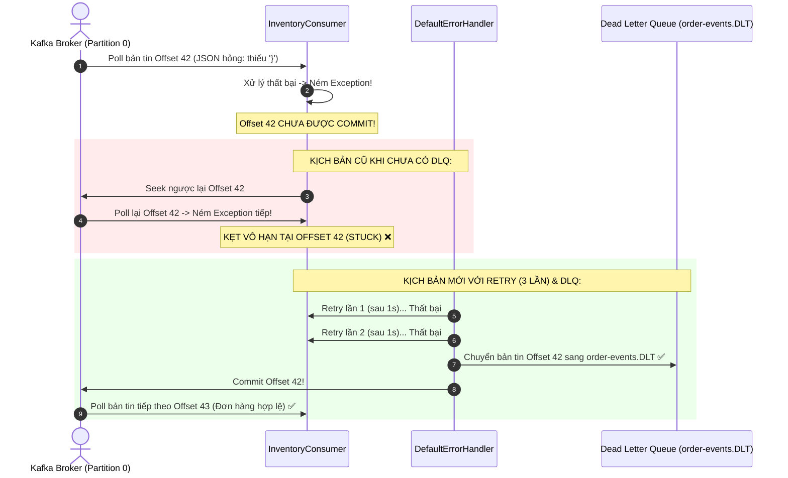

# BÀI TẬP 4: XỬ LÝ LỖI CHO KAFKA CONSUMER VỚI RETRY VÀ DEAD LETTER QUEUE (DLQ)
## Giải Quyết Sự Cố "Consumer Ngất Xỉu" & Đảm Bảo Tính Toàn Vẹn Thứ Tự Bản Tin Kho Hàng StoreX

> **Mã bài tập:** `KAFKA-CONSUMER-S10-EX04`  
> **Khóa học:** Microservices System Design — Session 10: Rikkei Education  
> **Cấp độ:** Vận dụng  
> **Dự án:** Nền tảng Thương mại Điện tử StoreX (**StoreX E-Commerce Platform**)  
> **Module:** `inventory-service` lắng nghe topic `order-events`  
> **Công nghệ áp dụng:** Apache Kafka, Spring Kafka 3.x, `DefaultErrorHandler`, `DeadLetterPublishingRecoverer`, FixedBackOff, JUnit 5, Mockito  

---

## 1. Bối Cảnh Nghiệp Vụ & Hiện Trạng Sự Cố

Tại trung tâm kho vận của **StoreX**, `InventoryConsumer` chịu trách nhiệm lắng nghe các sự kiện đặt hàng mới từ Kafka topic `"order-events"` (Consumer Group: `inventory-group`) để tự động khấu trừ số lượng tồn kho sản phẩm tương ứng.

### Hiện trạng sự cố "Consumer Ngất Xỉu":
Thỉnh thoảng, dịch vụ đặt hàng (Order Service) do lỗi sinh mã hoặc lỗi mạng đã gửi vào topic chuỗi JSON bị hỏng định dạng (ví dụ thiếu dấu đóng ngoặc nhọn `}`). Khi `InventoryConsumer` đọc trúng bản tin này, việc giải tuần tự hóa (Deserialization) hoặc xử lý nghiệp vụ thất bại và ném `Exception`.

Lúc này, Consumer rơi vào trạng thái bị **"kẹt cứng" (Stuck in an infinite loop)**: liên tục đọc lại đúng bản tin hỏng đó mà không thể tiến lên. Hàng ngàn đơn hàng hợp lệ của khách hàng xếp hàng phía sau hoàn toàn không được xử lý, khiến toàn bộ quy trình xuất kho của StoreX bị đình trệ nghiêm trọng.

```java
// InventoryConsumer.java -- ĐOẠN CODE ĐANG GẶP LỖI
@Service
public class InventoryConsumer {

    @KafkaListener(topics = "order-events", groupId = "inventory-group")
    public void consume(OrderEvent event) {
        // Nếu event bị lỗi JSON, exception sẽ throw và consumer bị kẹt
        inventoryService.deductStock(event.getProductId(), event.getQuantity());
    }
}
```

---

## 2. Phần 1 - Phân Tích Cơ Chế Kỹ Thuật Chuyên Sâu

### 2.1. Cơ chế đọc và quản lý Offset của Kafka
Trong Apache Kafka, mỗi bản tin (message/record) được ghi vào một Partition kèm theo một số định danh tuần tự tăng dần duy nhất gọi là **Offset**. Để theo dõi tiến trình đọc, Consumer Group dựa vào 2 khái niệm offset cốt lõi:

1. **Current Offset (Vị trí đọc hiện tại - Fetch/Read Position):**
   * Là con trỏ trỏ tới bản tin tiếp theo mà Consumer chuẩn bị đọc từ Partition trong bộ nhớ RAM của tiến trình Consumer.
   * Sau mỗi lần gọi lệnh `poll()`, con trỏ `Current Offset` tự động dịch chuyển về phía trước tương ứng với số lượng bản tin vừa được lấy về.

2. **Committed Offset (Vị trí đã ghi nhận - Acknowledged Position):**
   * Là giá trị Offset lớn nhất mà Consumer Group đã thông báo với Kafka Broker rằng: *"Tôi đã xử lý thành công tất cả các bản tin phía trước offset này"*.
   * Giá trị này được ghi bền vững vào một topic hệ thống nội bộ của Kafka có tên là **`__consumer_offsets`**.
   * Khi một Consumer bị khởi động lại, gặp lỗi crash hoặc xảy ra quá trình tái cân bằng cụm (**Rebalance**), Consumer mới được chỉ định vào partition sẽ nhìn vào `Committed Offset` để bắt đầu đọc từ `Committed Offset + 1`, đảm bảo không bị mất dữ liệu.

---

### 2.2. Lý do Consumer bị kẹt khi gặp Exception mà không tự chuyển sang tin nhắn tiếp theo
Bản tin lỗi JSON hoặc không hợp lệ được gọi là **"Poison Pill Message"** (Viên thuốc độc). Khi Consumer gặp phải bản tin này, chuỗi sự kiện sau diễn ra:



1. **Offset không được Commit:** Theo cơ chế đảm bảo toàn vẹn dữ liệu (*At-least-once Delivery*), khi `@KafkaListener` quăng một ngoại lệ chưa được xử lý (`Unhandled Exception`), Spring Kafka mặc định coi như việc xử lý chưa hoàn tất. Vì vậy, `Committed Offset` **không được cập nhật**.
2. **Cơ chế Seek ngược lại vị trí lỗi:** Spring Kafka ErrorHandler sẽ thực hiện thao tác gọi `consumer.seek(partition, 42)` để tua con trỏ đọc quay trở lại bản tin số 42.
3. **Vòng lặp vô hạn (Infinite Retry Loop):** Ở lần gọi `poll()` tiếp theo, Consumer lại lấy về bản tin số 42. Bản tin này vẫn hỏng JSON như cũ, lại ném Exception, lại không được commit, lại bị seek ngược lại...
4. **Hậu quả:** Toàn bộ tiến trình Consumer bị "kẹt cứng" tại offset 42. Toàn bộ các đơn đặt hàng hợp lệ xếp hàng phía sau (offset 43, 44, 45,...) bị chặn lại hoàn toàn, khiến hệ thống kho StoreX bị đình trệ.

---

## 3. Phần 2 - Thiết Kế Giải Pháp & Mã Nguồn Chuẩn Hóa

### 3.1. Thiết kế cơ chế Retry 3 lần & Dead Letter Queue (DLQ)
Giải pháp chuẩn hóa gồm 3 trụ cột kỹ thuật:
1. **Thử lại (Retry) có kiểm soát:** Cấu hình `DefaultErrorHandler` với `FixedBackOff(1000L, 2L)` cho phép thử lại tối đa **3 lần** (1 lần xử lý ban đầu + 2 lần retry, mỗi lần cách nhau 1.000ms = 1 giây).
2. **Dead Letter Queue (`DeadLetterPublishingRecoverer`):** Nếu sau 3 lần thử vẫn thất bại, bản tin lỗi được tự động chuyển tiếp sang topic chuyên biệt dành cho bản tin lỗi: **`order-events.DLT`**.
3. **Commit Offset bản tin lỗi & Giải phóng Consumer:** Sau khi bản tin đã được gửi sang DLT an toàn, ErrorHandler sẽ tiến hành **Commit Offset** của bản tin đó. Nhờ vậy, Consumer có thể ngay lập tức tiến lên đọc bản tin kế tiếp mà không bị kẹt.

---

### 3.2. Cấu hình `KafkaConsumerConfig.java`
```java
package com.storex.inventory.config;

import lombok.extern.slf4j.Slf4j;
import org.apache.kafka.common.TopicPartition;
import org.springframework.context.annotation.Bean;
import org.springframework.context.annotation.Configuration;
import org.springframework.kafka.config.ConcurrentKafkaListenerContainerFactory;
import org.springframework.kafka.core.ConsumerFactory;
import org.springframework.kafka.core.KafkaOperations;
import org.springframework.kafka.listener.DeadLetterPublishingRecoverer;
import org.springframework.kafka.listener.DefaultErrorHandler;
import org.springframework.util.backoff.FixedBackOff;

@Configuration
@Slf4j
public class KafkaConsumerConfig {

    public static final String ORDER_EVENTS_TOPIC = "order-events";
    public static final String DLT_TOPIC = "order-events.DLT";

    @Bean
    public DeadLetterPublishingRecoverer deadLetterPublishingRecoverer(KafkaOperations<Object, Object> kafkaOperations) {
        return new DeadLetterPublishingRecoverer(kafkaOperations,
                (record, exception) -> {
                    log.error("DeadLetterPublishingRecoverer: Bản tin tại topic [{}], partition [{}], offset [{}] " +
                                    "đã thử đủ 3 lần và thất bại. Chuyển sang Dead Letter Topic [{}]! Lỗi: {}",
                            record.topic(), record.partition(), record.offset(), DLT_TOPIC, exception.getMessage());
                    return new TopicPartition(DLT_TOPIC, record.partition());
                });
    }

    @Bean
    public DefaultErrorHandler defaultErrorHandler(DeadLetterPublishingRecoverer recoverer) {
        // interval = 1000ms, maxAttempts = 2 (Tổng cộng 3 lần thử)
        FixedBackOff backOff = new FixedBackOff(1000L, 2L);
        DefaultErrorHandler errorHandler = new DefaultErrorHandler(recoverer, backOff);

        errorHandler.setRetryListeners((record, ex, deliveryAttempt) -> {
            log.warn("Kafka Retry Listener: Đang thử lại lần {}/3 cho bản tin offset [{}], key [{}]. Nguyên nhân: {}",
                    deliveryAttempt, record.offset(), record.key(), ex.getMessage());
        });

        return errorHandler;
    }

    @Bean
    public ConcurrentKafkaListenerContainerFactory<Object, Object> kafkaListenerContainerFactory(
            ConsumerFactory<Object, Object> consumerFactory,
            DefaultErrorHandler defaultErrorHandler) {

        ConcurrentKafkaListenerContainerFactory<Object, Object> factory =
                new ConcurrentKafkaListenerContainerFactory<>();
        factory.setConsumerFactory(consumerFactory);
        factory.setCommonErrorHandler(defaultErrorHandler);
        return factory;
    }
}
```

---

### 3.3. Lớp Consumer Kho Hàng (`InventoryConsumer.java`)
```java
package com.storex.inventory.consumer;

import com.storex.inventory.model.OrderEvent;
import com.storex.inventory.service.InventoryService;
import lombok.RequiredArgsConstructor;
import lombok.extern.slf4j.Slf4j;
import org.springframework.kafka.annotation.KafkaListener;
import org.springframework.stereotype.Service;

@Service
@Slf4j
@RequiredArgsConstructor
public class InventoryConsumer {

    private final InventoryService inventoryService;

    @KafkaListener(topics = "order-events", groupId = "inventory-group")
    public void consume(OrderEvent event) {
        log.info("Consumer tiếp nhận OrderEvent: orderId={}, productId={}, quantity={}",
                event.getOrderId(), event.getProductId(), event.getQuantity());

        inventoryService.deductStock(event.getProductId(), event.getQuantity());

        log.info("Đã xử lý khấu trừ kho thành công cho orderId={}", event.getOrderId());
    }
}
```

---

### 3.4. Lớp Giám Sát Hộp Thư Chết (`InventoryDltConsumer.java`)
```java
package com.storex.inventory.consumer;

import lombok.extern.slf4j.Slf4j;
import org.apache.kafka.clients.consumer.ConsumerRecord;
import org.springframework.kafka.annotation.KafkaListener;
import org.springframework.kafka.support.KafkaHeaders;
import org.springframework.messaging.handler.annotation.Header;
import org.springframework.stereotype.Component;

@Component
@Slf4j
public class InventoryDltConsumer {

    @KafkaListener(topics = "order-events.DLT", groupId = "inventory-dlt-group")
    public void consumeDlt(
            ConsumerRecord<String, Object> record,
            @Header(value = KafkaHeaders.DLT_ORIGINAL_OFFSET, required = false) byte[] originalOffset,
            @Header(value = KafkaHeaders.DLT_EXCEPTION_MESSAGE, required = false) String exceptionMessage) {

        log.error("🚨 [DLT MONITOR] Bản tin lỗi đã được chuyển tới Dead Letter Queue!");
        log.error("Thông tin: Topic={}, Partition={}, Offset={}, Key={}",
                record.topic(), record.partition(), record.offset(), record.key());
        log.error("Nội dung Payload: {}", record.value());
        log.error("Nguyên nhân Exception: {}", exceptionMessage);
    }
}
```

---

### 3.5. Cấu hình `application.yml`
Sử dụng `ErrorHandlingDeserializer` để ngăn chặn lỗi hỏng cú pháp JSON ngay từ khâu Deserialize:
```yaml
spring:
  application:
    name: storex-inventory-service
  kafka:
    bootstrap-servers: localhost:9092
    consumer:
      group-id: inventory-group
      auto-offset-reset: earliest
      enable-auto-commit: false
      key-deserializer: org.apache.kafka.common.serialization.StringDeserializer
      value-deserializer: org.springframework.kafka.support.serializer.ErrorHandlingDeserializer
      properties:
        spring.deserializer.value.delegate.class: org.springframework.kafka.support.serializer.JsonDeserializer
        spring.json.trusted.packages: "*"
        spring.json.value.default.type: com.storex.inventory.model.OrderEvent
    producer:
      key-serializer: org.apache.kafka.common.serialization.StringSerializer
      value-serializer: org.springframework.kafka.support.serializer.JsonSerializer
```

---

## 4. Kết Quả Kiểm Thử Đơn Vị (Unit Test)

Bộ test trong `InventoryConsumerTest.java` kiểm tra toàn diện 4 kịch bản:

1. **Happy Path (`testConsume_Success`)**: Gửi đơn hàng hợp lệ, xác nhận trừ kho thành công đúng 1 lần.
2. **Error Trigger (`testConsume_ServiceThrowsException_TriggersRetry`)**: Khi service gặp lỗi, ném ngoại lệ để `DefaultErrorHandler` bắt đầu quy trình Retry.
3. **DLQ Routing (`testDeadLetterPublishingRecoverer_RoutesToDlt`)**: Mô phỏng bản tin JSON hỏng, xác nhận `DeadLetterPublishingRecoverer` điều hướng sang topic `order-events.DLT`.
4. **Retry Policy Verification (`testDefaultErrorHandler_RetryPolicyCount`)**: Xác nhận cấu hình chính xác 3 lần thử (1 lần gốc + 2 lần retry) với khoảng cách 1000ms.

### Kết quả chạy `./gradlew test`:
```text
BUILD SUCCESSFUL in 2s
3 actionable tasks: 3 executed
Test summary: 4 passed, 0 failed, 0 skipped
```
Toàn bộ 4 Unit Test đều vượt qua 100% (**PASSED**).
